Offline Manual
Version 1.0.60

RINAS WELD

# Introduction

Introduction

This document is intended to be a useful guide for people who wants to deploy the Rinas Welding System in their production. However, it only contains documentation on the offline part of the overall system. For documentation on the online part of the system, consult the online manual.

When referenced to a specific name in the interface of the system, the name will appear inside hyphens.

In the subsequent paragraphs a set of descriptions is completed to accommodate the work of first-time users.

# General Description

General Description

## Model based off-line programming

Model based off-line programming

A main component in the kernel common to all RINAS systems is the model control functionality.

This functionality will create and maintain a complete combined model giving full control of the 3D workspace and the objects within this space.

The model control also includes the Product Model that defines the work piece, possibly with information about the welds that are to be processed by the robot.

The model control also includes the Equipment Model describing all relevant equipment objects used in the production.

By applying, to the resulting powerful 3D model, the knowledge from the Process Model and the Work strategy Model, the automatic off-line generation will create clash free robot programs.

In this operation, where the time dimension is added, the combined model is enhanced to a dynamic model, which, extended through the on-line feedback, becomes a model of the whole robotized production.

From the combined model several outputs may be extracted of which the most important is the complete ready-to-use robot-welding program.

Also available is a graphical simulation showing all robot movements for the complete robot program. This graphical simulation is not an active part of the robot generation process but is solely to be used to visualize the robot movements.

## The product model

The product model

The Product Model is established by importing the work piece model from a CAD system.

The system has the capability of importing a number of commonly used formats representing work piece models, including parameterized descriptions, 2 and 2½ dimensional representations.

This makes the system independent of any specific CAD system.

## The process model

The process model

The Process Model contains all relevant information necessary for the welding process to be performed properly.

All rules, moving patterns, conditions, tolerances and welding process parameters that are needed for achieving the welding quality required are either predefined or can be defined by the user.

The Process Model can be enriched by the user in a structured way as experienced from the production is collected.

# The equipment model

The equipment model

Every installation is more or less unique in order to fulfil the demands of customers production.

The Equipment Model contains all relevant information about the geometry, kinematics and inverse kinematics for the processing equipment (gantry, robot, tools, etc.)

This information is used during the generation of robot programs. Especially by the simulation facilities, which are used to secure that generated robot programs are clash free.

Finally, and after completed generation, if the user wishes, the graphical simulation can be executed in order to visualize the performance of the generated robot program.

## The work strategy model

The work strategy model

The generation of robot programs for welding is based on several work strategies. These relates to elements such as:

Application of welding rules and specifications

Sequencing and scheduling of welding operations

Sensing requirements

Task sub-division

Collision free path generation

Efficiency considerations and more.

All of these elements are combined in the Work Strategy Model allowing the daily generation of correct and efficient robot programs to be made without requiring interventions from the user.

## Installation

Installation

The installation of the product must be carried out according to the “readme” located in the installation package. The “Read me Notes” contains supplementary information on installation procedures.

# Interface

Interface

The main interface to the system is divided into four major areas. Menu, toolbars, scene and three status information bars.

## Progress Wizard

Progress Wizard

The wizard contains the necessary steps from ‘Import the CAD file’ to ‘Exporting the Production package’ to the shop-floor system.

The progress wizard is interactive; many of the stages will be time stamped. The date and time will appear in the upper left corner of the stage in the Progress Wizard.

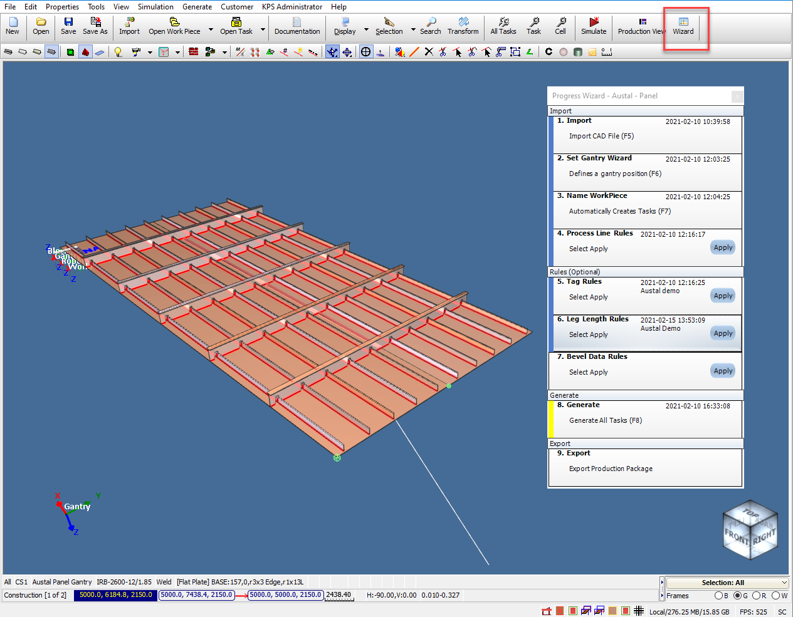

Figure 1 Progress Wizard

Figure 1 Progress Wizard

## Interface – Context menu

Interface – Context menu

When mouse right clicks on top of a process line the context menu below will appear.

This menu gives access to a number of functions please see below.

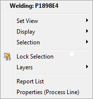

Figure 2 Right Click – Context menu

## Interface – Process line properties

Interface – Process line properties

The process line properties can be accessed from:

Context menu, mouse right-click on top of process line.

Search

Via this menu the following attributes can be added to the process line. See below.

Figure 3 Process line – Properties

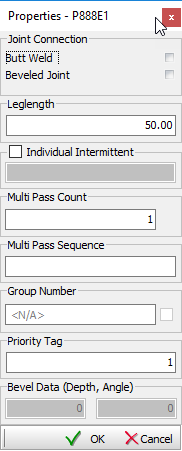

# Menu Area

Menu Area

The menu area provides access to all the functionality inside the system. In the following paragraphs a short introduction is given for each area in the menu.

## File Menu

File Menu

The file menu handles all input and output functionallity which includes loading of projects, importing, exporting, settings, documentation and printing.

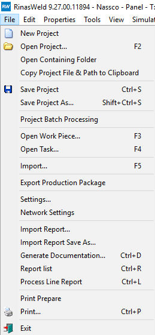

Figure 4 File Menu

### Open Project:

Open Project:

Used for loading of already created project files.

(See page 32 for more information).

### Save Project:

Save Project:

Save the current project.

### Save Project As:

Save Project As:

Used for saving the current project in a different location and/or with a different name.

### Open Work Piece:

Open Work Piece:

Open a work piece. An example on a work piece could be the entire block or a segment of the imported cad drawing.

### Open Task:

Open Task:

Open dialog with list of Tasks, including the Task Properties.

(See page Error! Bookmark not defined. for more information)

### Import:

Import:

Open the import interface to import a specific cad file.

(See page 33 for more information)

### Export Production Package:

Export Production Package:

Updates the project file and saves the GDF file for the online part of the system.

### Settings:

Settings:

The general settings for the system are available through this menu item.

(See page 112 for more information)

### Import Report:

Import Report:

Report file from Import, including CAD header, date/time information and statistic.

### Documentation:

Documentation:

Display documentation for the generated data.

### Report List:

Report List:

Display an interactive and more comprehensive list of events from the generating process.

### Print:

Print:

Printing facility to print a hard copy of the scene or create a segment overview.

### Exit:

Exit:

Close the application.

## Edit Menu

Edit Menu

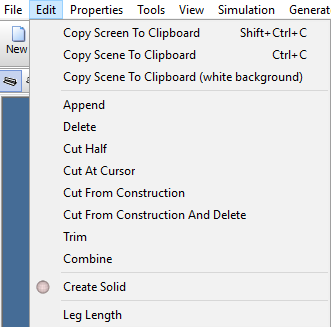

Figure 5 Edit Menu

The edit menu handles all modification functionality which includes weld line manipulation and change of leg length.

These features can also be accessed through the tool bars below the menu.

Figure 6 Editing Tools

### Delete:

Delete:

Delete weld line simply deletes the selected weld line.

### Append:

Append:

Append a deleted weld line to a construction. It is only possible to append a weld line that has been approved by the system. An example of a not approved weld line could be two plates, which either is too far away from each other, or one of the plates is located inside the other plate. This is typically true if the tolerances in the cad file are too large to be handled.

### Combine:

Combine:

This feature allows two weld lines to be combined into a single weld line.

### Cut Half:

Cut Half:

This item cuts the selected weld line into two equally sized weld lines.

### Cut At Cursor:

Cut At Cursor:

This item cuts the selected weld line into two weld lines at the nearest cursor position.

### Cut From Construction:

Cut From Construction:

Enables the opportunity to first select a weld line, second a construction line, and third to enter the distance from the construction line from where the weld line should be divided into two weld lines.

### Cut From Construction and Delete:

Cut From Construction and Delete:

Same as ‘Cut from construction’ but also deletes the part of the weld line nearest to the cursor during selection of weld line.

### Trim:

Trim:

Trims a user defined length of a process line. From the process line end, nearest to the selection point.

### Leg Length:

Leg Length:

This option edits the leg length on the selected weld line.

## Properties Menu

Properties Menu

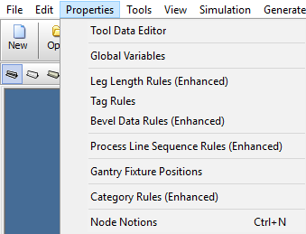

Figure 7 Properties Menu

The properties menu handles all system properties to perform a generate process.

### Leg Length Rules:

Leg Length Rules:

The leg length property gives access to the leg length rule interface. This interface gives the ability to define several rules for applying different leg lengths to the weldings.

### Multi Path Rules:

Multi Path Rules:

The multi path gives access to the multi path rule interface. This interface gives the ability to define several rules for applying different multi pats numbers to the weldings.

### Process Sequence Rules:

Process Sequence Rules:

The ‘Process Sequence Rules’ gives access to the Process Sequence Rules rule interface. This interface gives the ability to define several rules for applying different welding sequences. (See page 46 for more information)

### Gantry Fixture Positions:

Gantry Fixture Positions:

Definitions of the gantry fixture positions are accessed here to enter a number of positions.

These positioned are later used when applying the position to the work piece.

(See page 70 for more information)

### Category Rules:

Category Rules:

This is the entry for defining the properties for mapping cad file names to general system naming convention.

(See page 35 for more information)

### Node Notions:

Node Notions:

Bunch:	Heracic structure to recognize actual situations.

Script:	Scripts to handle the actual situations.

## Tools Menu

Tools Menu

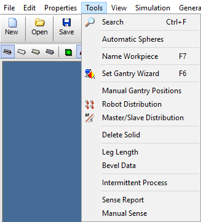

Figure 8 Tool Menu

This menu contains a set of tools to initiate different work preperation methods.

### Search:

Search:

Tool for searching. Search for solids, categories or process lines. (See page 102 for more information)

### Name Workpiece:

Name Workpiece:

Displays a dialog box where the name of the work piece/Tasks can be defined.

There is an option to save a Task template. (See page 106 for more information)

### Set Gantry Wizard:

Set Gantry Wizard:

This allows the user to click on two lines and then select a gantry fixture position to place the work piece correctly under the gantry. (See page 72 for more information)

### Delete Solid:

Delete Solid:

Interface for deleting solids, which is not used during the generating process, from the construction. 
(See page 108 for more information)

### Leg Length:

Leg Length:

Interface for setting leg length on selected weld lines. (See page 109 for more information).

## Tools Menu Continued

Tools Menu Continued

### Sense Report:

Sense Report:

Interface for checking if manual assisted sensing is required by the system.

(See page 110 for more information)

### Manual Sense:

Manual Sense:

Interface for making manual sense points and adjusting the automatically made sense point.

The interface can in combination with the ‘Sense Report’ show the sense points there need assisters by the RinasWeld operator.  (See page Sense Report Tool 35 for more information)

## View Menu

View Menu

The view menu handles all controls for the graphics engine and mode switches to control the feedback.

These features can also be accessed through the tool bars below the menu.

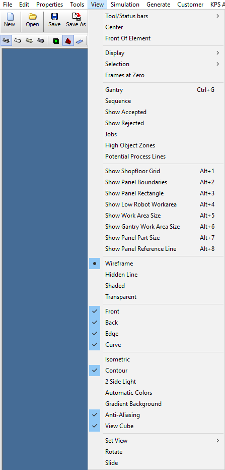

Figure 9 View Menu

### Center:

Center:

Double click on the drawing to position the nearest point in centre of the screen. Furthermore, the new centre of rotation is this point.

Figure 10 Front of Element

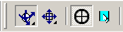

### Front Of Element:

Front Of Element:

Double click on a construction line to change the view in front of this element.

### Display:

Display:

All the display groups processed can be enabled or disabled here. New added data to the drawing may cause new group to automatically appear here for display selection.

### Selection:

Selection:

This item controls the behavior of the nearest mouse functionality. All the selection groups processed can be enabled or disabled here. New added data to the drawing may cause new groups to automatically appear here for selection.

### Frames At Zero:

Frames At Zero:

When checked the frames will be displayed in their respective zero points.

### Gantry:

Gantry:

Figure 11 View Gantry

Display the boundary of the gantry, external axis limit.

### Sequence:

Sequence:

Display the sequence of the generated weld lines in the loaded task.

### Wire Frame Model:

Wire Frame Model:

Toggle between a solid display of the drawing and a wire frame model.

### Hidden line:

Hidden line:

Hidden line removal is an extension of wireframe rendering where lines (or segments of lines) are covered by surfaces are not drawn.

### Shaded:

Shaded:

Enable shaded mode.

### Transparent:

Transparent:

Enable transparent mode.

### Isometric:

Isometric:

Toggle between isometric view, and perspective view. Isometric view is very good at displaying exact geometry but very hard to determine the depth of the model. Perspective mode gives a good depth of the drawing but not that good when comparing geometry.

### Contour:

Contour:

Enable the contour of all the drawn faces.

### Two side light:

Two side light:

Enable the light form two sides, (inside and outside)

### Automatic colors

Automatic colors

Overrules the colors from the Import, and apples automatic colors (variation of brown steel)

### Set View:

Set View:

Set the camera/view to different positions like; top view, bottom view, left view, default view (Reset), etc.

### Rotate:

Rotate:

Selects left mouse button to rotate the drawing.

### Slide:

Slide:

Selects left mouse button to slide the drawing.

## Simulation Menu

Simulation Menu

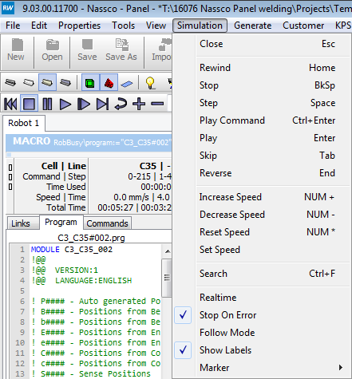

Figure 12 Simulation Menu

The simulation menu handles the simulation mode.

### Load:

Load:

Load the simulation mode. All necessary data 
will be built for the simulation. When ‘Load’ has 
been activated, all the simulation controls will be 
active. The simulation controls acts as a  (video cassette recorder).

### Rewind:

Rewind:

Rewind simulation to the first step.

### Stop:

Stop:

Stop the simulation.

### Step:

Step:

Execute the next step of the simulation.

### Play Command:

Play Command:

Execute the next simulation command; a simulation command is the same as a movement command in the 
robot program.

### Play:

Play:

Play the simulation.

### Skip:

Skip:

Skip the rest of the simulation command.

### Reverse:

Reverse:

Playing the simulation in reverse mode.

### Increase Speed:

Increase Speed:

Increase the speed of the simulation.

### Decrease Speed:

Decrease Speed:

Decrease the speed of the simulation.

### Set Speed:

Set Speed:

Set the speed of the simulation.

### Real time:

Real time:

Set the simulation speed to real time.

### Stop On Error:

Stop On Error:

Enables stop when error occurs during simulation.

### Inverse Marker:

Inverse Marker:

Inverse the direction of the marker shown during simulation.

### Set Marker Length:

Set Marker Length:

Set the length of the markers (tool unit vector).

### Follow Mode:

Follow Mode:

The simulation follows the movement of the robot tool.

### Close:

Close:

Exit the simulation mode.

## Simulation control

Simulation control

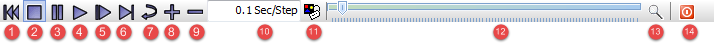

Figure 13 Simulation Control

Rewind
Rewind simulation to the first step.

Stop
Stop the simulation.

Step
Execute the net step of the simulation.

Play
Play the simulation

Play Command
Execute the next simulation command a simulation command is the same as a movement command in the robot program.

Skip
Skip the rest of the simulation command.

Reverse
Playing the simulation command.

Increase Speed
Increase the speed of the simulation.

Decrease Speed
Decrease the speed of the simulation.

Set Speed, directly
Set the speed of the simulation.

Set Speed, indirectly 
Set the speed of the simulation, using input box.

Slider
Changes the simulation position.

Search Job & Jump
Find a cell in a job, and jump to it or Jump to simulation command.

Close 
closes the simulation.

Short-Cuts.

Mouse left thumb button	Simulating forward/backwards.

Keyboard ‘,’ ‘.’	Simulating forward/backwards.

Keyboard ‘+’,’-‘	Increasing / decreasing the step size.

Keyboard ‘*’ 	Switch between step size 0.1 (Slow) and 0.5 (Fast)

Keyboard ‘1,2,3,4,5,6,7,8,9’	Jumps to 10%, 20%...90%

## Generate Menu

Generate Menu

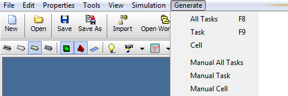

Figure 14 Generate Menu

The generate menu starts all the generate processing.

These tasks can also be activated from the tool bar.

### All Tasks:

All Tasks:

Generate on all tasks defined in the system.

### Task:

Task:

Figure 15 Task

Generate on current loaded task.

### Cell:

Cell:

Generate on a selected cell or multiple cells.

### Manual All Task:

Manual All Task:

Enable the possibility to manually change the sequence for generation of task, cell and process lines.

### Manual Task:

Manual Task:

Enable the possibility to manually change the sequence for generation of cell and process lines.

### Manual Cell:

Manual Cell:

Enable the possibility to manually change the sequence for generation of process lines.

## Scene

Scene

Figure 16 View of Construction

The scene view displays a combination of construction, weld lines, segment lines and more.

Solids are displayed as full-face solids. The first figure to the right depicts a construction made up of a number of connected solids. Solids are visualized with a color which can be defined individually. Small yellow lines can be observed especially on the wire frame model (bottom). These lines indicate the thickness vector of the solid.

Weld lines are displayed as red lines at intersection between two solids. Segment areas are displayed as blue lines.

The figures at the right of this page give a few examples on how the construction can be displayed.

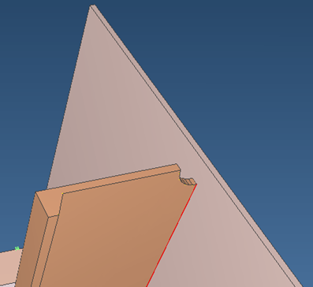

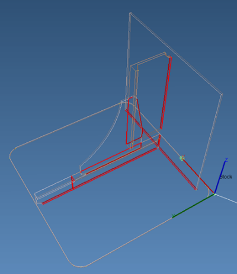

Figure 17 Zoomed View

Figure 18 Wire frame View

## Status bar Information

Status bar Information

The status information located at the bottom of the application displays all kind of user feedback when moving the cursor. In addition, it displays information about the loaded data and modes.

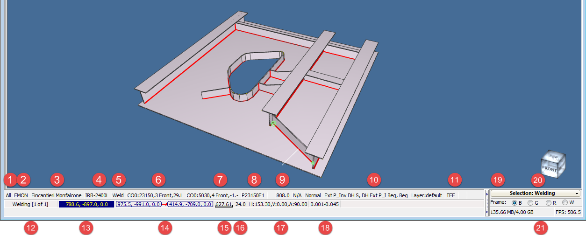

Figure 19 Status bar Information

Name of loaded work piece.

Name of loaded task.

Name of loaded gantry.

Name of loaded robot.

Process mode.

Parent data.
Element ID: Solid, Face, Facet, Entity and Type
Ex. ‘L:11129,5,r0x5,r1x24L’

Connected data. 
Ex. ‘BP:11045,0,-1.-‘
Category name: connected solid number, face number, entity number, entity type.

Entity identification. P = Parent Solid, E = Entity. Ex. ‘P:11173,E:26’.

Leg length size.

Assigned data reference (Bunch Class, Script, Situation).

Joint Type.

Type of nearest item.

Nearest xyz position relative to cursor.

Nearest begin and end position of selected entity. Begin point is the small green cube on the screen, endpoint is bigger cube on the screen.

Length of selected entity [mm].

End Solid Offset, Offset distance to solid at end of joint [mm].

Horizontal and vertical angles.

Approx. volume of parent solid and connected solid [m3].

Current frame all values are represented in. Click to select block, gantry or robot frame.

Current Selection mode, e.g. All, Construction, Weld.

# Open Project

Open Project

The project file is a collection of all the data used to process a CAD drawing.

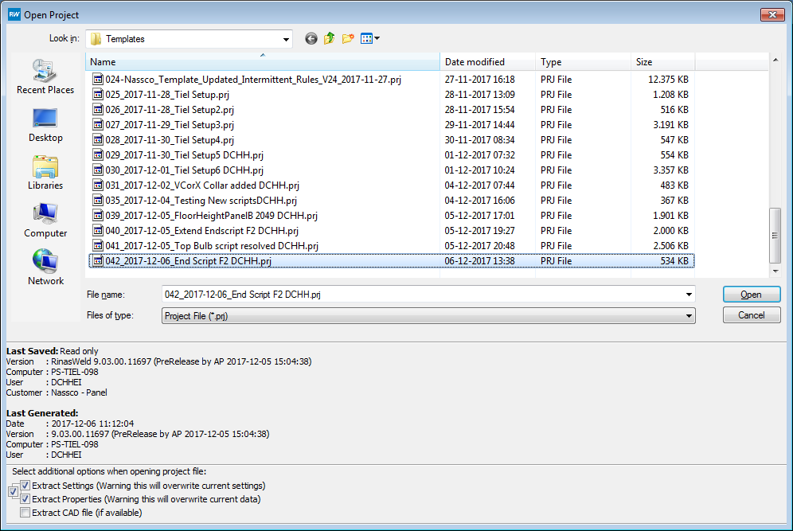

Figure 20 Open Project

The content of a project file is the properties defined in the system, settings, cad file, generated data, process files, etc.

This enables easy support, because all that is needed to create the exact same situation is contained in the project file.

The version number of the system who saved the project file is displayed above the additional settings.

Three additional options are available when opening a project file.

## Extract Settings

Extract Settings

When the ‘extract settings’ are checked all the settings who existed when this project file was created will replace the current settings currently present in the system.

## Extract Properties

Extract Properties

The ‘extract properties’ option replaces the properties entered into the system. The items which is replaced is located in the ‘properties’ menu and represents, gantry fixture positions, etc.

## Extract CAD file

Extract CAD file

The ‘extract cad file’ option prompts for a location to save the extracted cad file. The system will only prompt if a cad file was available when the project file was saved.

# CAD Import

CAD Import

The import section is capable of importing in two different modes, standard and segment mode. The standard mode imports the cad file into one big work piece without any special work handling operation.

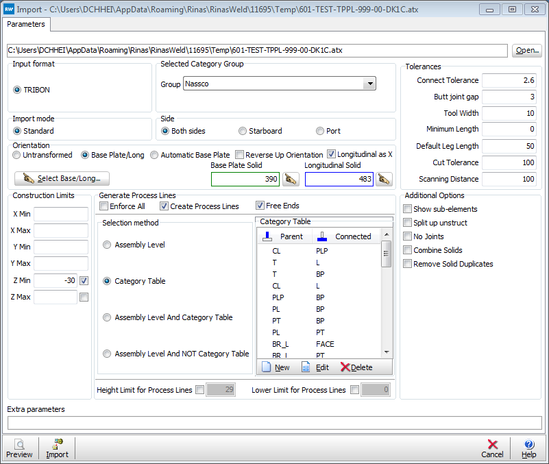

Figure 21 Import

The segment mode is a mode that gives the user access to divide the work piece into several segments via an automatic or manual mode.

## Import interface

Import interface

The interface for setting up the import parameters consists of the following areas.

### Input format

Input format

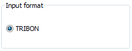

Figure 22 Input Format

This describes the type of the cad file, which is selected for import. The reason for this selection is that no general file record exists in different file formats and may finally depend on the knowledge from the user.

TRIBON = File extension ‘ATX’

### Selected Category Group

Selected Category Group

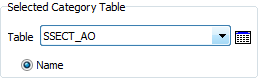

Figure 23 Translation Table

The translation table is a conversion table that translates the name of solids from the CAD file to name of solids in the RINAS weld system.

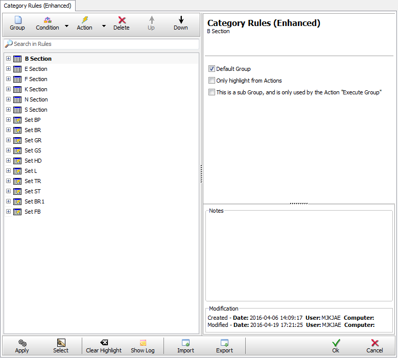

Figure 24 Category Rules

The above picture displays the Category Rule Interface.

### Side

Side

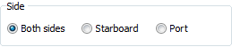

Figure 25 Import Side

The shipside selection is used to select the side part from the cad file.

### Orientation

Orientation

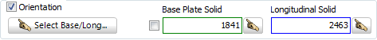

Figure 26 Import Orientation

The orientation of the construction is defined by selected base plate and long.

Use the small hand next to the edit field to click on the appropriate solid.

Please be aware that the cad file must have been imported, before doing a second import.

### Construction limits

Construction limits

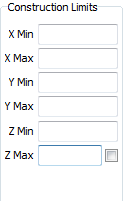

Figure 27 Import Construction limits

An import limit gives the possibility to import only a part of a cad file. Specify the minimum and maximum coordinates in the tree axis X, Y, Z. The coordinates are specified in block coordinates.

Maximum and minimum import limits define the selected area to remove during import.

Only enter max and min direction to limit the import in.

Leave all the fields blank to import the entire model.

### ‘Z Max’, Checkmark

‘Z Max’, Checkmark

Used in combination with “Construction limits” and removes the solid if some of it is inside the tolerance.

## Generate process lines

Generate process lines

There is several ways to define the welds there has to be welded.

Options:

Assembly level

Category Table

Assembly level and Category Table

Enforce All

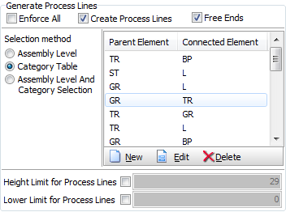

Figure 28 Generate Process Lines

### Using Category Table

Using Category Table

Figure 29 Generate Process Lines using Category Table

### Generate process lines

Generate process lines

Specify if the system via the import should create process lines for all combinations of solids (e.g. Base plates, Longitudinal, Transverses, Stiffeners, Brackets, Collar plates, Bricks) according to some rules. The most common rule says that there should not be generated process lines between two longitudinally solids.

Optional feature to select where to create process lines. Select combinations to generate process line.

BP:	Base plate.

CL:	Collar plate.

L:	Long.

TR:	Transverse.

ST:	Stiffener.

Process lines are attached to a solid (1. parent). The other solid (2. connected) is connected to the first solid.

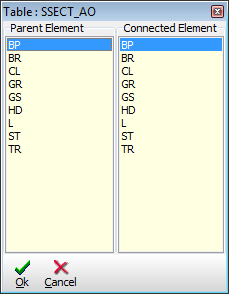

Figure 30 Table

Press the ‘New’ button to setup a new combination of process lines to weld.

Generate process lines between solids of type: Base plate, Longitudinal, Transverse and Stiffener.

### Height limits for Process lines

Height limits for Process lines

Drops all welding’s above the specified value.

### Lower Limits for Process Lines

Lower Limits for Process Lines

Drops all welding’s below the specified value.

### Using Enforce all

Using Enforce all

Generate process lines independently of the Category Group rules.

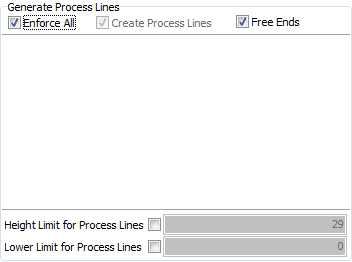

Figure 31 Generate Enforce all

### Free ends

Free ends

Removes small process lines when these is located in the end of a solid (profile)

### Tolerances

Tolerances

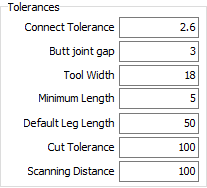

Figure 32 Import Tolerances

The system is capable of handling a variety of tolerances to compensate for errors in the cad model. Following tolerances settings have been made available for the user to override.

Leave the tolerances blank for default operation

### Connect tolerance

Connect tolerance

Tolerance for connecting two plates, for example a longitudinal to a base plate.

### Butt joint gap

Butt joint gap

Tolerance for making butt joint.

### Tool Width

Tool Width

Define a width of a tool to enable cutting of weld lines in narrow spaces.

The parameters ‘Connect tolerance’, ‘Gab between elements’ and ‘Tool width’ can have influence on each other.

### Minimum Length

Minimum Length

Defines a minimum length of weld lines generated by the system, for example will a value of 350 remove welding lines with a length of 350mm or less.

### Default Leg length

Default Leg length

Enable a default leg length on all weld lines.

### Cut Tolerance

Cut Tolerance

Process line cutting tolerance. This value should be larger than the largest slot 
(Default value 50mm)

### Scanning Distance

Scanning Distance

Setup, Scanning distance used for determining ‘End solid offset’
(Default value 50mm)

Please see figure, bunch class attribute ‘End Solid offset’

## Additional options

Additional options

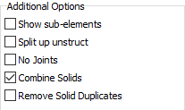

Figure 33 Import Options

### Show sub-elements

Show sub-elements

Some CAD systems represent elements as solids added to or subtracted from each other. For the user to be able to see all the sub-elements use this option.

### Split up unstruct

Split up unstruct

During import the CAD drawing is analysed for example to find perfect solids with thickness vectors. ‘Split up unstruct’ splits up and makes a drawing of the construction without analysing it.

Can be used if the full import fails. In this situation a drawing of the construction can be of great help for fixing the errors.

### No Joint

No Joint

During import the CAD drawing is analysed a process line is applied, when this option is used no analyse will take place. This is only for checking the CAD geometry.

### Combine Solids

Combine Solids

Combines solids connected baseplates into a single baseplate

### Remove Solid Duplicates

Remove Solid Duplicates

Removes duplicated solids entries existing in the CAD file.

### Properties

Properties

The properties area contains all the general data to create an automatic system.

# Gantry Fixture Position

Gantry Fixture Position

In many gantry installations the block must be placed at specified fix points (Fixture Positions), which can be physical pins placed on the floor of the gantry

In that way the gantry robot knows the position of the block in the gantry space.

Figure 61

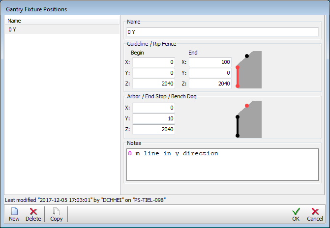

Explanation of Gantry Position Fixtures

Three points are used to specify the position of the block.

These points are defined in the gantry position fixture.

Two of the points are used to represent a Guideline and the third point is used as a single a point.

Multiple sets of fixture positions can be inserted.

## User Click/Selection

User Click/Selection

The value for the user selected line 1 and 2 on the block and the values entered in the gantry position fixture definition give the orientation of the gantry relative to the block.

First selected line is mapped as Guideline.

Second selected user line will connect to the Gantry pin / Arbor / Ends stop.

Figure 62 Top view of block

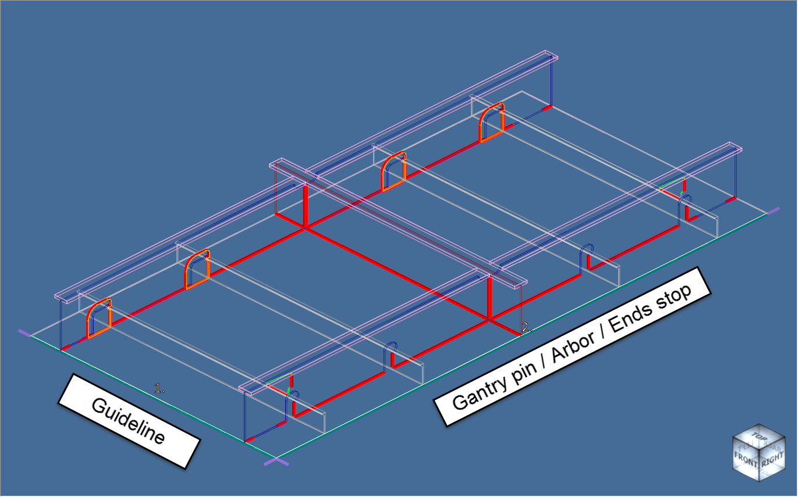

## User Set Gantry wizard

User Set Gantry wizard

The value for the user selected line 1 and 2 on the block and the values entered in the gantry position fixture definition give the orientation of the gantry relative to the block.

First selected line is mapped as line defined by gantry fixture point 1 and point 2.

Second selected user line will connect to the gantry pin 3.

### Set Gantry wizard step 1 of 4

Set Gantry wizard step 1 of 4

Figure 63 Gantry wizard step 1 of 4

### Set Gantry wizard step 2 of 4

Set Gantry wizard step 2 of 4

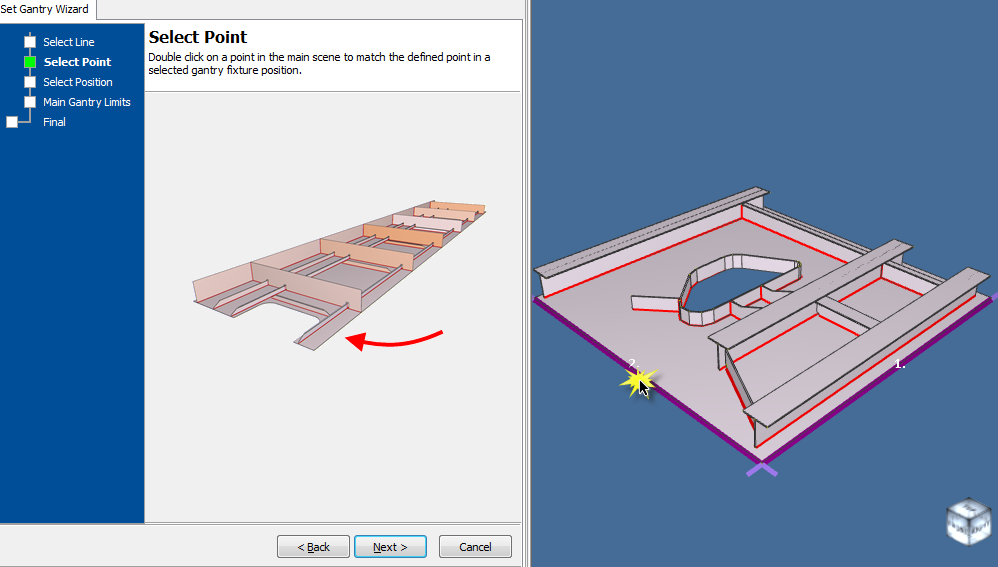

Figure 64 Gantry wizard step 2 of 4

### Set Gantry wizard step 3 of 4

Set Gantry wizard step 3 of 4

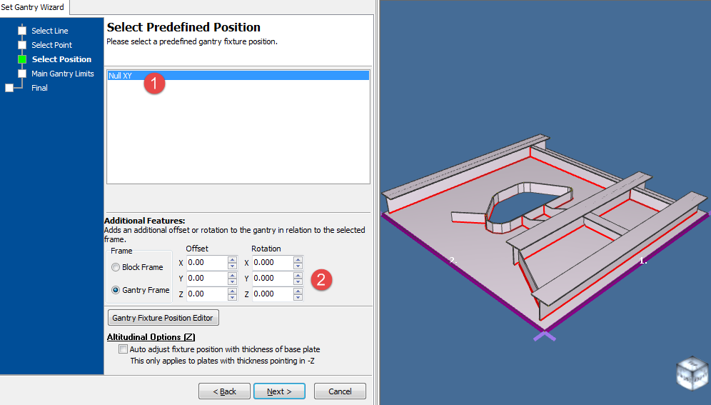

Figure 65 Gantry wizard step 3 of 4

First select the Gantry fixture position. Secondly change offset if needed.

### Set Gantry wizard step 4 of 4

Set Gantry wizard step 4 of 4

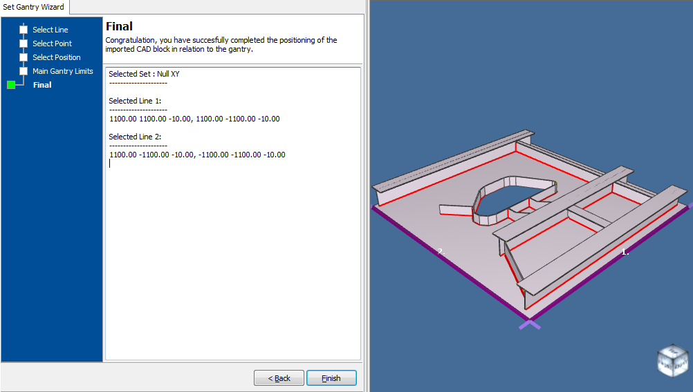

Figure 66 Gantry wizard step 4 of 4

## Node Notions - Bunch Type Description

Node Notions - Bunch Type Description

## Bunch Types

Bunch Types

When programs are generated, each welding situation will be checked against the Bunch Classes from top to bottom, and the Bunch Class that first meet the welding requirements will be selected.

The Bunch Classes are defined by the user and can contain up to ten different kinds of Bunch Attributes.

These Bunch Attributes each corresponds to different welding situations.

Figure 67 Node Notions

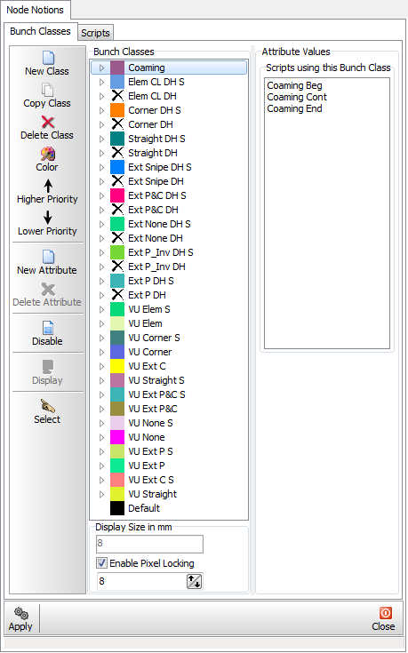

## Bunch Attributes

Bunch Attributes

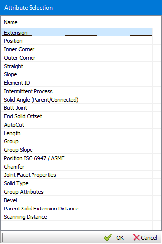

Figure 68 Bunch Attributes

The bunch attributes configures the behavior of the created bunch class by combining several attributes.

### Extension

Extension

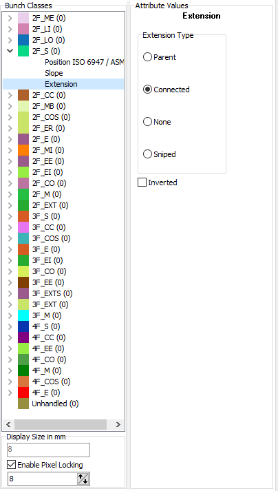

Figure 69 Bunch Classes Extension

The ‘Extension’ attribute defines the relation between ‘Parent solid/Connected solid’ in the end of the Process Line. The ‘Extension’ attribute contains welding situations as showed in Figure 70 - Figure 73

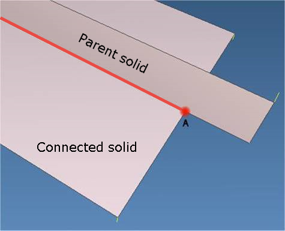

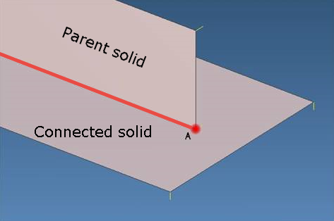

Figure 70 Extension Parent	                                   Figure 71 Extension Connected

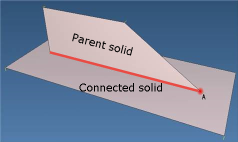

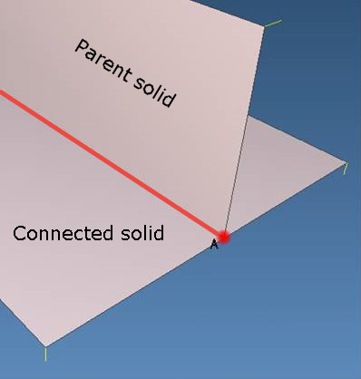

Figure 72 Extension Sniped                                                                       Figure 73 Extension None

### Position

Position

The ‘Position’ attribute contain welding situations as follows:

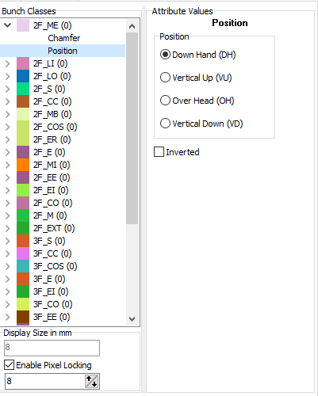

Figure 74 Bunch Classes Position

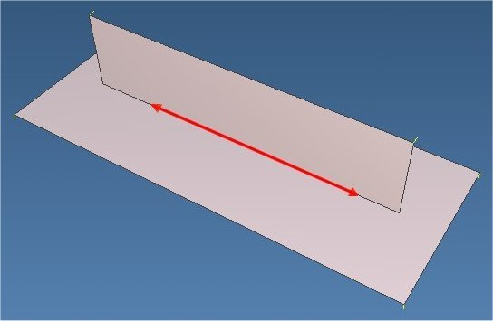

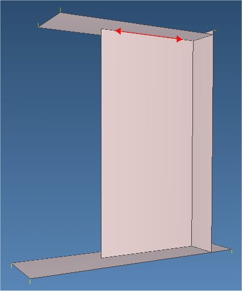

Figure 75 Down Hand (DH)                                                                     Figure 76 Over Head (OH)

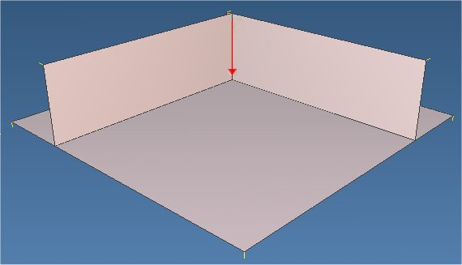

Figure 77 Vertical Up (VU)                                                             Figure 78 Vertical Down (VD)

### Inner Corner, Outer Corner and Straight

Inner Corner, Outer Corner and Straight

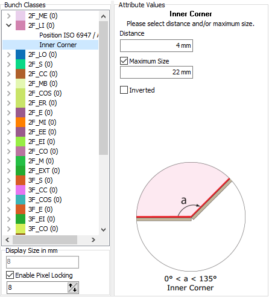

Figure 79 Bunch Classes Inner Corner

The “Inner Corner, Outer Corner and Straight” attributes specifies when a welding situation should be considered as a corner or a straight welding line, when two weld lines are connected.

Between 0 and 135 the welding situation is considered an inner corner.

Between 135 and 225 the welding situation is considered a straight line.

Between 225 and 360 the welding situation is considered an outer corner.

The Distance in each of these Bunch Classes is the maximum allowed gap between two profiles to still consider them to be connected. This is used for handling minor Cad tolerance.

The Maximum size can be enabled in Inner corner, and outer corner attributes. They determine the maximum size allowed for a corner, where the smallest joint in the corner defines the size of it.

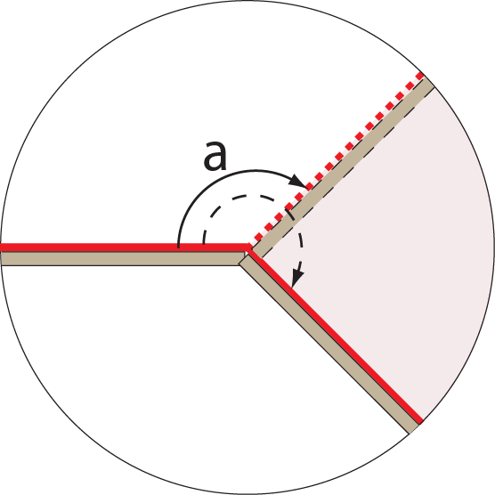

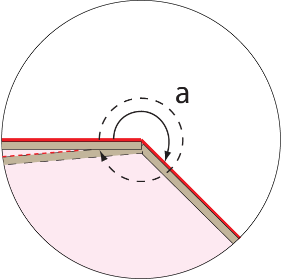

### Slope

Slope

The ‘slope’ attributes specifies when a welding situation should be inside a specific slope. The slope is defined as the vertical angle to the base plate.

For example:

On a horizontal process line, the slope angel would be 0°

On a vertical process line, the slope angel would be 90°

Figure 80 Bunch Classes Slope

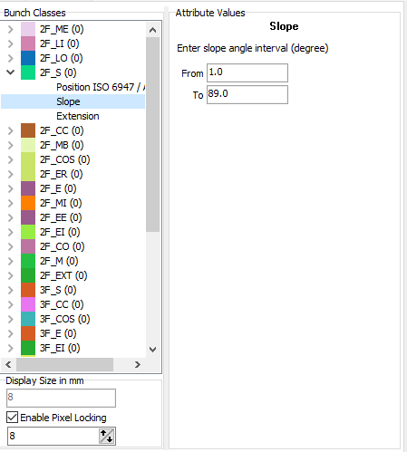

### Element ID

Element ID

The ‘Element ID’ attributes specifies translated CAD element connections. 

If the “Independent order” is checked then both names is checked in parent and connected data.

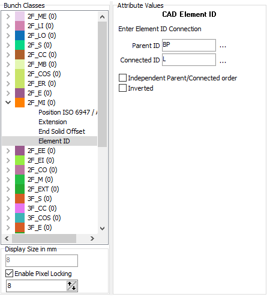

Figure 81 Bunch Classes CAD Element Table

### Intermittent process

Intermittent process

This attribute specifies a detection of intermittent process.

This is used to bind intermittent part to a bunch type, and then to a script.

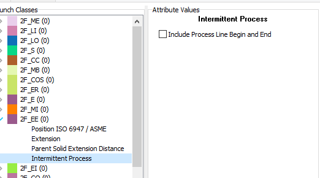

Figure 82 Bunch classes Intermittent process

### Solid Angle (Parent/Connected)

Solid Angle (Parent/Connected)

This attribute specifies a detection of profile angle between Parent and connected solid.

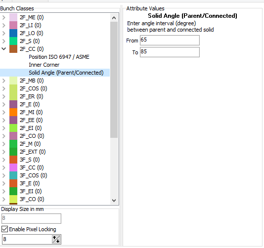

Figure 83 Bunch Classes Solid Angle

### End Solid offset

End Solid offset

This attribute specifies a detection of joints with an ‘End Solid Offset’ within a certain interval.

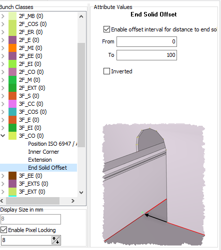

Figure 84 Bunch Classes End Solid Offset

### Length

Length

This attribute specifies detection of joints, with a length within a certain interval.

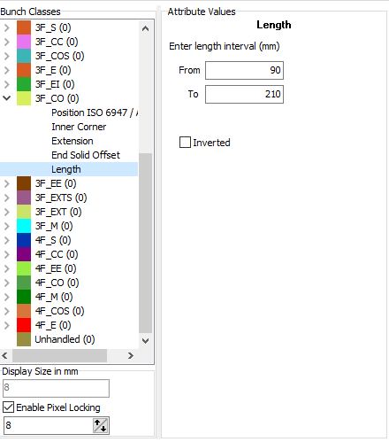

Figure 85 Bunch Classes Length

### 8.5.10 Position (ISO 6947)

8.5.10 Position (ISO 6947)

The ‘Position ISO 6947’ specifies detection of process lines in the positions PA – PG.

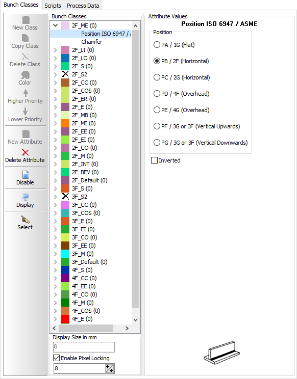

Figure 86 Bunch Classes Attribute Position (ISO 6947)

#### General command

General command

Each line in the script must be one of the general commands or the comment statement. General commands describe the robot tool movements and the process, and they are independent of the robot to be used.

Examples of general commands in scripts: , WELD, etc.

#### Robot command

Robot command

Robot commands are specific for each individual robot type. When a robot program is generated, all commands in the scripts actually being used are translated to robot commands for the robot in question.

#### Position set

Position set

The position of the tool, absolute or relative, is specified in the script commands and consists of three position coordinates X, Y and Z and three orientation angles.

Example of command using a position set:

WELD $A (10, 10,-20) VU-CONT

X, Y and Z are coordinate expressions in mm. Each coordinate value is expressions in which system variables can be used.

#### Coordinate System

Coordinate System

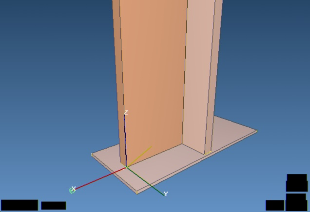

Figure 87 Coordinate System

Each connection type has a specified coordinate system connected to it. This allows a general specification regardless of where on the construction model the script will be finally applied.

The orientation of the coordinate system is shown in the graphic representation of each connection type.

The coordinate system is applied to the parent and connected solid. The coordinate is mapped as described below.

RinasWeld Standard coordinate system. (S)

X: Welding Direction

Y: Along Connected solid surface

Z: Along Parent solid surface

Example:

WELD $A S(0, 0, 5) P (0,0)

This will weld 5 mm from the process line along the parent solid.

#### Commands

Commands

##### Comments in scripts

Comments in scripts

Format of the command:

; <Comment text>

Example:

; Collar plate welding

Explanatory comments can be entered in the script without affecting the resulting robot program. Comment lines must start with one of these (; // or ’) characters.

##### command

command

Format of the command:

<ref.pt> (X,Y,Z) <angle ref> (<angle ref>Stick, <angle ref>Tilt) <Weld data name>

Example 1:

$A (10, 0, -20) P (0,0)

Example 2:

MOVE $W (0, 0, -50) P (0,0)

Movements of the tool towards welding start position and away from a completed welding may be defined using the  command.

A  command may imply movement of the robot and the gantry as well. How the movement is actually performed in the final robot program depends on the circumstances.

##### WELD command

WELD command

Format of the command:

WELD <ref.pt> (X,Y,Z) <angle ref> (<angle ref>Stick, <angle ref>Tilt) <Weld data name>

Example 1:

WELD $A (10, 0,-20) P (0,0) VU-

Example 2:

WELD $W (0, 0,-50) P (0,0) VU-SOFTEND

Linear welding can be specified using the WELD command.

Reference point and position set information is specified the same way as for the  command.

Weld data name should be specified too, thus allowing specific welding data to be applied individually for each weld command that is to be performed.

If no reference to a sensed point (ref.pt.) is entered in the command, then the coordinate set will be used as relative to the point reached with the previous command.

##### SETUP command

SETUP command

This command describes user tolerances for deviating from the defined stick and tilt angle, in case of limitations in space or work area.

Setup conditions are changed after the command is issued.

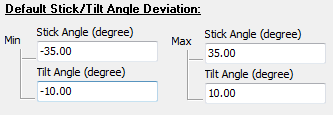

Figure 88 Default Stick / Tilt Angle

General tolerance setup in settings will be used in scripts with no SETUP <Angle> declaration.

SETUP <command>  (Min, Max)

Example:

// Using default setup values

Move $A (10,10,10) M (0,0)

Move $A (5,0,0) M (0,0)

Weld $A (5,0,0) M (0,0) CS_VUP

// changing stick to -15 to 0 degree working area

SETUP _ANGLE_STICK (-15,0)

Weld $A (6,0, 0) P (0,0) VUP

Example: TOL_ANGLE_STICK

// Allowed Minimum Deviation = -15°, Maximum = 0°

SETUP _ANGLE_STICK (-15,0)

// Allowed Minimum Deviation = Default, Maximum = 0°

SETUP _ANGLE_STICK (default,0)

##### IF-Then SETUP command

IF-Then SETUP command

Conditional statements can be used in scripts, System variables can be used in the conditions.

IF (condition) THEN

(statements)

END IF

Example:

IF WLEN <=210 THEN

Weld $A (20,0,0) P(5,0) WeldDataSet1

Weld $A (40,0,0) P(15,0) WeldDataSet2

END IF

#### Script – System Variables

Script – System Variables

## Torch Angles

Torch Angles

The torch angle is defined by specifying a stick and a tilt angle relative to the predefined default torch angle.

The default torch angle will mostly be defined as:

Stick:	neutral, that is neither sticking nor dragging

Tilt:	the elevation angle will lie in the angular half-plane (between the two plates to be welded)

### Angles Relative to the Process Lines

Angles Relative to the Process Lines

The torch angle can be specified as an offset to the default stick and tilt angle relative to the current joint (begin or end of process line) by using the angle references P(ΔS, ΔT) or X(ΔS, ΔT) or the adjacent joint by using the angle reference Y(ΔS, ΔT).

The tilt angle offset (ΔT) is used to change the elevation of the angular half-plane. The stick angle offset (ΔS) is used to change the stick angle of the torch, but the torch will stay within the angular half-plane (possibly tilted according to the specified tilt angle offset (ΔT)).

Referencing relative to the opposite joint by using Y(ΔS, ΔT) is very useful in corner situations where current process line ends joining another plate (e.g. in corners).

WELD <ref.pt> (X,Y,Z) <angle ref> (Stick, Tilt) <Weld data name>

<ref.pt> (X,Y,Z) <angle ref> (Stick, Tilt) <Weld data name>

Example:

WELD $A (5,0,0) P(0,0) DH_CONT

WELD $A (5,0,0) X(0,0) DH_CONT

WELD $A (5,0,0) X(W,W) DH_CONT

WELD $A (5,0,0) Y(0,0) DH_CONT

WELD $A (5,0,0) Y(W,W) DH_CONT

Note: The above references will maintain the torch within the plane (angular half-plane or as tilted according to ΔT offset) regardless of the stick angle value!

### Angles Relative to the Process Lines (Spherical)

Angles Relative to the Process Lines (Spherical)

The torch angle can be specified as an offset to the default stick and tilt angle relative to the process line by using the spherical angle references XS(ΔS, ΔT) or the adjacent process lines by using the angle reference YS(ΔS, ΔT). When using the spherical angle references, the tilt angle offset will define the elevation of the torch relative to the default elevation angle no matter the stick angle value.

WELD <ref.pt> (X,Y,Z) <angle ref><ref> (Rotation Z, Tilt Rotation) <Weld data name>

<ref.pt> (X,Y,Z) <angle ref><ref> (Rotation Z, Tilt Rotation ) <Weld data name>

Tilt angle is in this case equal to the elevation angle.

Example:

WELD $A (5,0,0) XS(0,0) DH_CONT

WELD $A (5,0,0) XS(W,W) DH_CONT

WELD $A (5,0,0) YS(W,W) DH_CONT

### Angles Relative to the Corner Median

Angles Relative to the Corner Median

The torch angle can be specified as an offset to the default stick and tilt angle relative to the corner median by using the angle references M(ΔS, ΔT).

Referencing relative to the corner median M(ΔS, ΔT) is very useful in corner situations especially when the corner angle can vary (open or closed corners).

WELD <ref.pt> (X,Y,Z) <angle ref> (Stick, Tilt) <Weld data name>

<ref.pt> (X,Y,Z) <angle ref> (Stick, Tilt) <Weld data name>

Example:

WELD $A (5,0,0) M(0,0) DH_CONT

### Angles as Rotations with respect to Script Coordinate System

Angles as Rotations with respect to Script Coordinate System

The torch angle can be specified as an offsets to the default stick and tilt angle relative to the script coordinate system by using the angle references MR(ΔX, ΔY, ΔZ), PR(ΔX, ΔY, ΔZ), XR(ΔX, ΔY, ΔZ) or YR(ΔX, ΔY, ΔZ).

WELD <ref.pt> (X,Y,Z) <angle ref><ref> (Rotation X, Rotation Y, Rotation Z) <Weld data name>

<ref.pt> (X,Y,Z) <angle ref><ref> (Rotation X, Rotation Y, Rotation Z) <Weld data name>

Example:

WELD $A (5,0,0) MR(0,0,5) DH_CONT

WELD $A (5,0,0) PR(0,0,5) DH_CONT

WELD $A (5,0,0) XR(0,0,5) DH_CONT

WELD $A (5,0,0) YR(0,0,5) DH_CONT

### Angle Reference

Angle Reference

These references P, M and D defines the reference tool angle, and the values entered is relative to this reference.

* Standard coordinate system, used in all examples above.

### Definition of Stick and Tilt angles

Definition of Stick and Tilt angles

General stick and Tilt definition.

This is used on angle reference ‘P’, ‘X’ and ‘Y’

## Reference point

Reference point

When the automatic sense operation has been performed, the sensed point can be referenced in the script commands.

For each connection type a reference point A is available.

When a reference point is referenced in the script, it must be preceded by a $ character.

Example of command using a reference point:

WELD $A (10, 0, -20) VU-CONT

In this case the coordinate set X, Y and Z (10, 0 and -20 mm.) are offset values relative to the reference point A.

It is possible to refer to the sense relation from the other end of the process line using a $W reference point.

Example of command using a $W reference point:

WELD $W (10, 0, -20) VU-CONT

A command with no reference point is defined as a relative movement. This movement will be relative to the prior executed command.

Example of command using a relative reference point:

WELD (10, 0, -20) VU-CONT

## Weld data name

Weld data name

Different weld data sets can be stored in the system under unique names. These names can be entered for each welding command in the scripts thus defining how the welding should be processed.

## Graphic Representation

Graphic Representation

When scripts are entered a graphic representation of the consequence is simultaneously displayed in a separate window on the screen.

Basically, the representation contains a draft of the connection type and indication of how the coordinate system is placed.

As  commands are entered blue lines are displayed indicating the defined movements.

As WELD commands are entered red lines are displayed indicating the welding movements.

Facilities exists allowing zooming in and out as well as rotation of the graphic representation.

## Error Messages

Error Messages

When any script line has been entered or changed it is immediately checked for consistency by the system if the bunch type has been applied and the situation exists.

If any syntactical or conceptual errors are found an informative error message will be displayed in the status bar.

# Squaring

Squaring

## Description

Description

Squaring is used to obtain the optimal welding angle.

The optimal welding angle is defined in the scripts, for a begin script it is the last WELD instruction and the first for an end or continue script.

## Welding

Welding

If the orientation of a begin- and end-script are different the move instruction in between them will interpolate between the two orientations.

## Minimum squaring length

Minimum squaring length

The squaring is done on the shortest distance possible, this can cause the robot to make a rapid orientation change and result in a bad welding quality, to prevent this there can be defined a minimum squaring length (see. Minimum squaring length: on page 116).

Figure 89 Squaring

# Tools

Tools

The tools menu allows the user to modify different situations before the generating process.

## Search

Search

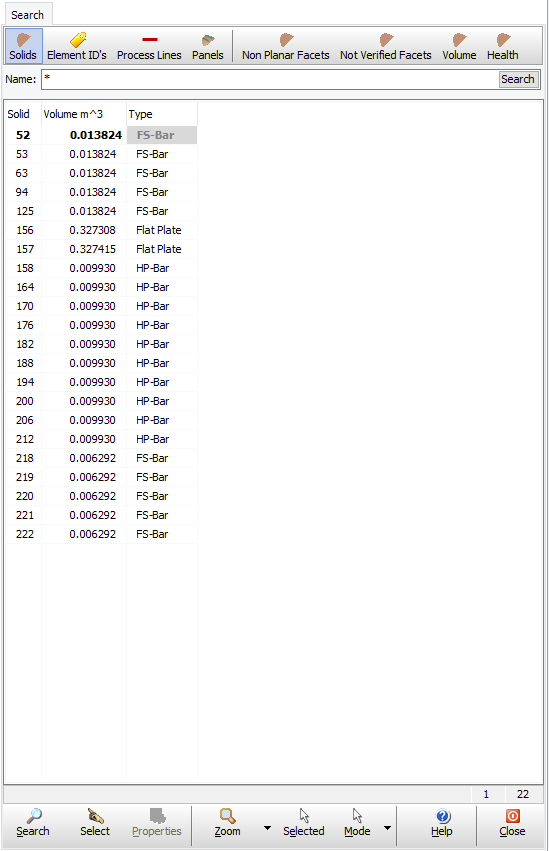

Figure 90 Search

Tool for searching. It is possible to search among Solids, Categories or Process Lines.

When the ‘ToolsSearch’ menu has been activated the ‘Search’ interface is shown. This interface gives the possibility to enter a search string and the type of search (Solids, Categories or Process Lines).

Multiple searches can be performed by separating the arguments by a comma, e.g. for Solids: 123, 45.

Examples for Categories could be: T, TR, L and for Process Lines: P120E13, P20E13. The search is started by pressing the ‘Search’ button.

### Tool - Search Right click context Menu

Tool - Search Right click context Menu

Right click on one or more items gives access to a context menu with this feature

Process line Properties

Select All

Copy Process Line Name

Cut Half

Delete From Line

Delete Selected Process Line(S)

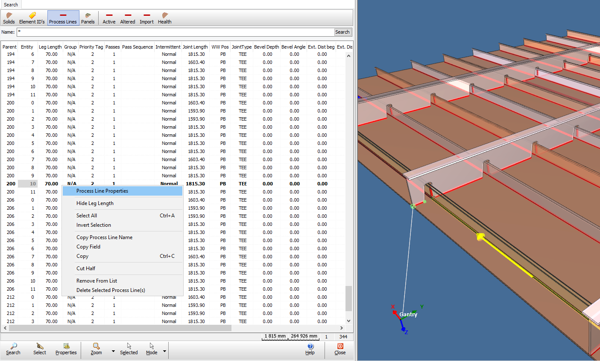

Figure 91 Search – Context menu

### Search example

Search example

When one of the found entities is selected from the list, the actual entity is shown on the drawing in yellow colour. If the entity from the list is double-clicked, the entity is shown in yellow colour and the drawing is zoomed to the selection.

Figure 92 Categories Search Result

### Search Wildcard descriptions

Search Wildcard descriptions

Wildcard for Solids search:

Name	Description

*	Displays all Solids

Wildcard for Category search:

Name	Description

*	Displays all Category

Wildcard for Process Lines search:

Name	Description

A*	Displays altered process lines

E*	Example: P120E*, or P*E*

P*	Example: P*E1, or P*E*

I*	Displays all process lines added by import

*	Displays all present process lines

## Name Workpiece

Name Workpiece

Automatic creates tasks based on last saved task template.

In ‘Open Task’ the is an option to save a task structure as task template.

(See page 107 for more information)

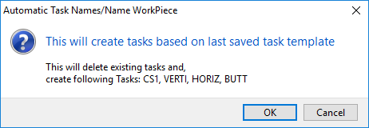

Figure 93 Name WorkPiece

## Open Task

Open Task

Open dialog with list of Tasks, including the Task Properties.

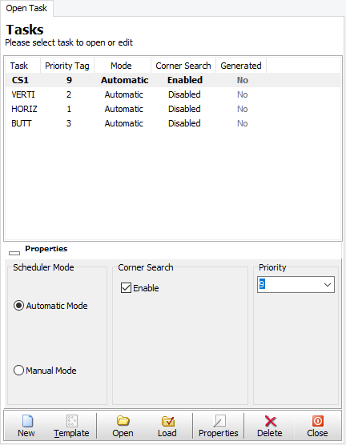

Figure 94 Open Task

Buttons

New:	Create a New task.

Template:	Save the current task structure and properties to a Template. For later use during ‘Name WorkPiece’.

Open:	Open Selected Task and close dialog.

Load:	Load selected Task, keep dialog open

Properties:	Dock/Undock properties section.

Delete: 	Delete selected task

Close:	Close dialog

## Delete Solids

Delete Solids

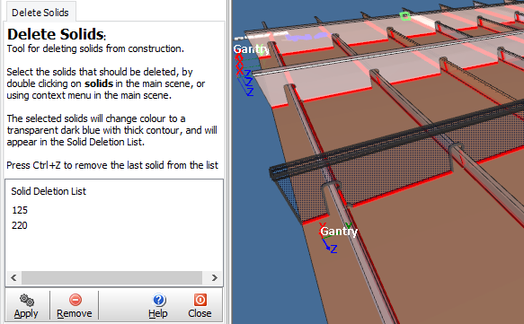

Figure 95 Delete Solid

Tool for deleting solids from construction:

Select the solids that should be deleted by double clicking on them in the main scene. The clicked solids will change color to dark blue and they will appear in the deletion list. To remove a solid from the deletion list, select the solid and press 'Remove'. Click 'Apply' to delete the solids listed in the deletion list from the construction.

## Leg Length Tool

Leg Length Tool

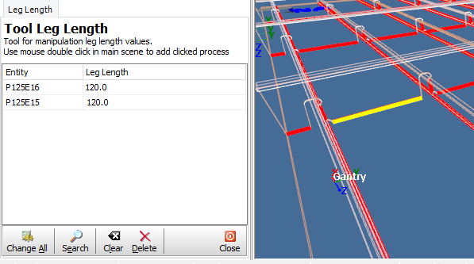

Figure 96 Leg Length Tool

Interface for setting leg length on selected weld lines. When ‘ToolsLeg Length’ is activated the ‘Leg length’ interface is shown.

In this interface it’s possible to either select individual weld lines from the graphical screen by double clicking on the weld line or to use the search facility. In the search facility it is possible to search for weld lines which lie in a user defined interval.

Change All: When the weld lines has been selected it’s possible to change the leg length for all the selected weld lines in one step or change the leg length for each weld line individually.

Search: Search for leg length within a user defined interval see figure 97

Clear: Clears the list.

Delete: Deletes the current selected item.

Help: Show help.

Close: Closes ‘Leg length’ panel.

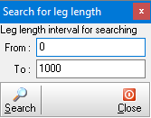

Figure 97 Leg Length Tool Search

## Sence Report Tool:

Sence Report Tool:

Interface for checking if manual assisted sensing is required by the system.

Figure 98 Sense Report

## Manual Sense Tool:

Manual Sense Tool:

Interface for making manual sense points and adjusting the automatically made sense point.

The interface can in combination with the ‘Sense Report’ show the sense points that need assistance by the RinasWeld operator.

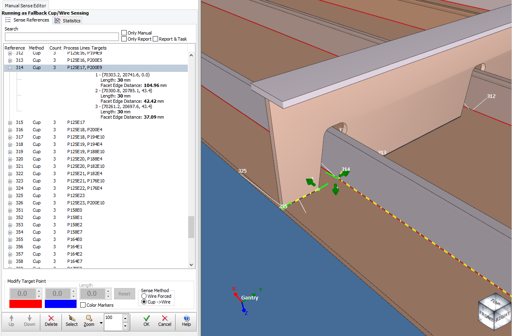

Figure 99 Sense Report

## Settings

Settings

The settings interface has different tabs that give the user the opportunity to adjust different settings.

## General

General

Figure 100 Setting General

### Generate process

Generate process

Selection of program to be generate

### Robot Limits:

Robot Limits:

Defines the maximum use of the robot links.

### Wrist Singularity Distance

Wrist Singularity Distance

Defines the minimum allowed distance to the singularity area.

### Weave Singularity Distance (TCP)

Weave Singularity Distance (TCP)

Defines the minimum allowed distance to the ‘singularity’ area (Robot’s centerline).

### Additional Points

Additional Points

Maximum welding distance before an extra point is inserted in the robot program

### Collision Control

Collision Control

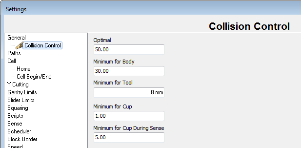

Figure 101 Setting Collision Control

#### Optimal:

Optimal:

Optimal distance desired but not required.

#### Minimum for body:

Minimum for body:

Minimum collision distance on the body part of the robot.

#### Minimum for tool:

Minimum for tool:

Minimum collision distance for the tool area of the robot.

#### Minimum for cup:

Minimum for cup:

Minimum collision distance for the Cup area of the robot.

#### Minimum for cup during sense:

Minimum for cup during sense:

Minimum collision distance for the Cup area of the robot while sensing.

## Path

Path

### Default export path:

Default export path:

Default path to select when the Export Production Package function is used.

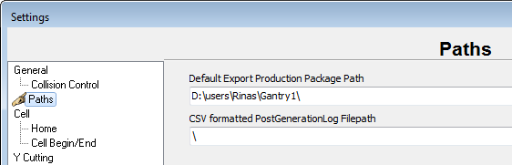

Figure 102 Setting Paths

### CSV formatted PostGenerationLog File path

CSV formatted PostGenerationLog File path

Default path to select for storing the CSV formatted log file.

### Cell Begin/End

Cell Begin/End

Figure 103 Setting Cell begin/end

#### Min. distance to nearest object:

Min. distance to nearest object:

The collision distance to the robot when finding a position to the robot for its home position.

#### Use maximum height from gantry limits:

Use maximum height from gantry limits:

If enabled then the offset value from max gantry limits is used to set the external height position of the robot. The robot is fixed in this height and can only move in XY direction.

#### Use cell passing height:

Use cell passing height:

Enabling passing height offset based on the actual cell height.

#### Gantry Limits

Gantry Limits

The gantry limits are the physical limitation of the installed gantry. No External axis’s movement past the defined area is possible.

Minimum and maximum values are entered and this defines a rectangular area for the gantry.

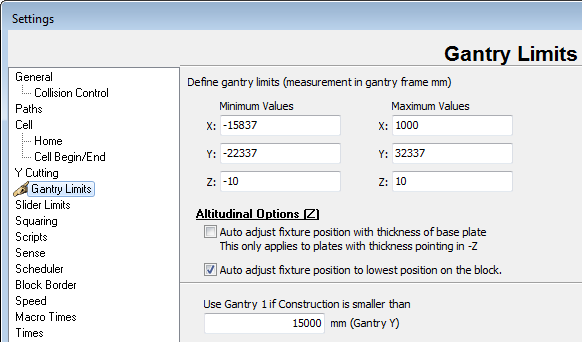

Figure 104 Setting Gantry Limits

The additional option ‘auto adjust fixture position’ are used to automatically adjust for the thickness of the base plate when clicking on the gantry fixture position. This automatically offsets the position to the bottom of the base plate.

The “Auto adjust fixture position to lowest position on the block”, automatically adjust the clicked level to the lowest value of the block.

## Squaring

Squaring

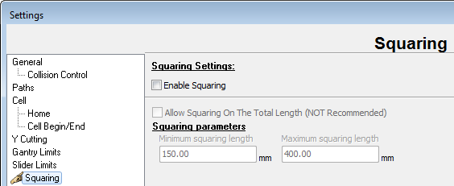

Figure 105 Setting Squaring

Activated if enabled.

### Minimum squaring length:

Minimum squaring length:

Minimum length before archiving required weld angle.

### Maximum squaring length:

Maximum squaring length:

Maximum length to try the squaring.

## Script

Script

### Default Stick/Tilt Angle Deviation:

Default Stick/Tilt Angle Deviation:

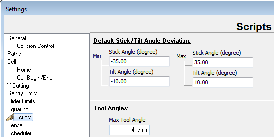

Figure 106 Setting Scripts

The maximum allowed angle deviation from the angles defined in scripts.

These limits can be altered directly in the scripts.

## Sense

Sense

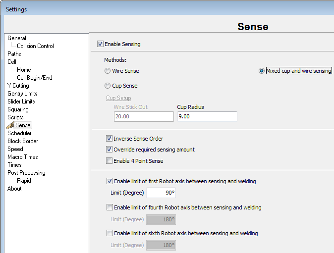

Figure 107 Setting Sense

#### Enable Sensing

Enable Sensing

This enables the sensing.

#### Inverse Sense order

Inverse Sense order

Enable this to sequence the sense movements in reverse order of the process lines.

#### Override required sensing amount

Override required sensing amount

If the three or four point is impossible to make, a two point is then accepted.

#### Enable 4 Point Sense

Enable 4 Point Sense

This enables 4 point sense.

#### Enable limits of first and sixth, Robot axis between sensing and welding

Enable limits of first and sixth, Robot axis between sensing and welding

Use this setting to minimize rotation between sensing and welding.

## Block Border

Block Border

### Use Base solid:

Use Base solid:

Enables the creation of a base solid where the production floor is located. Remember to enter the height position of the base solid.

### Use Block Border:

Use Block Border:

Create a solid border around the block. The values are relative to the squared area of the entire block. If the block is imported in segment mode, then the border are relative to the loaded segment.

Figure 108 Setting Block Border

### Enable Main Gantry Limits

Enable Main Gantry Limits

Limits the External axis, by enabling this setting the gantry positions can be forced to a stay inside certain working array.

The limitation related to ‘Block Border’, ‘Max width’ in Y-direction.

The limitation related to ‘Block Border’, offset from block in Y-direction.

The Main Gantry Limits is accessible in the Gantry Wizard, and in daily use the Gantry Wizard is where the Main Gantry Limits is used.

## Speed

Speed

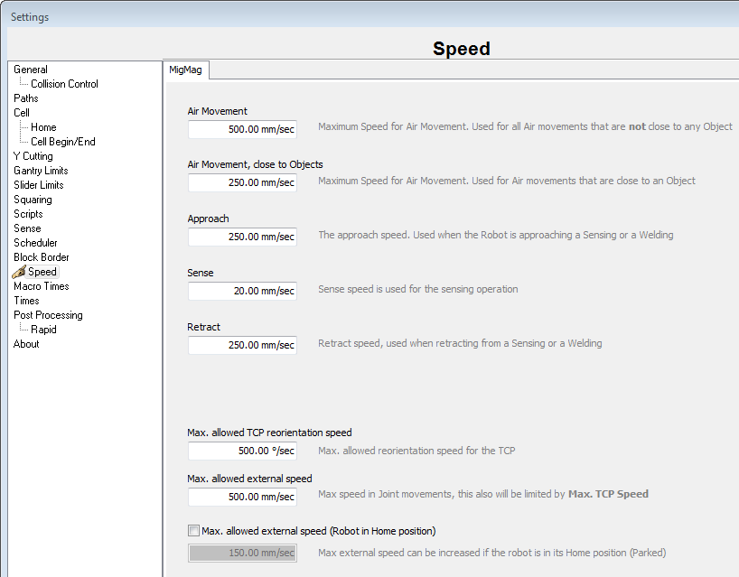

Figure 109 Setting Speed

### Max. internal air movement:

Max. internal air movement:

Percent allowed internal speed of the robot.

### Max. combined air movement:

Max. combined air movement:

Percent allowed combined speed of internal and external movement of the robot.

### Max. external process movement:

Max. external process movement:

Percent allowed speed of external movement of the robot during process.

### Max. allowed linear speed:

Max. allowed linear speed:

Maximum speed of robot when using linear movements.

### Max. allowed external speed:

Max. allowed external speed:

Maximum speed of robot on external joints.

### Max. allowed joint speed:

Max. allowed joint speed:

Percent of maximum speed of robot when using joint movements (not linear).

## Macro Time

Macro Time

A fixed working time can be defined for each macro call, used for calculating the Total Job time.

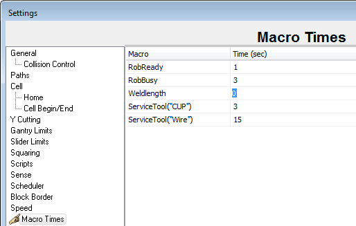

Figure 110 Setting Macro Time

## Times

Times

Times used for calculating the Total Job time.

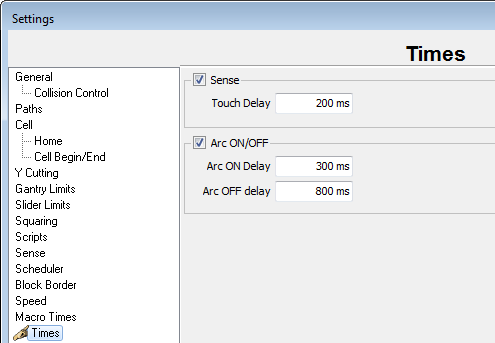

Figure 111 Setting Times

## Rapid

Rapid

Path to External Process Data.

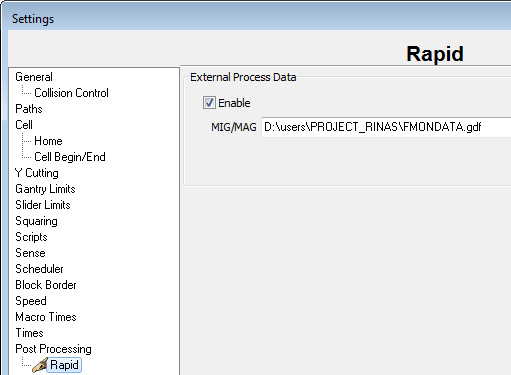

Figure 112 Setting Rapid

## About

About

Information about the last time the setting was modified.

Figure 113 Setting About

## Generate

Generate

The generate menu activates automatic methods for generation.

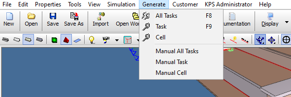

Figure 114 Generate

## Documentation

Documentation

The documentation window appears after generating, the windows are showing statistics of the result from the generation.

The window is divided in three areas.

Task list statistics including Summary 
Generation statistics, showing used computer time, weld meters, joint meters etc.

Rinas Process Report
Detailed ‘Rinas Process Report’ for selected task.

List of files generated
List of the files generated in the selected task.

Please see detailed description in the following pages.

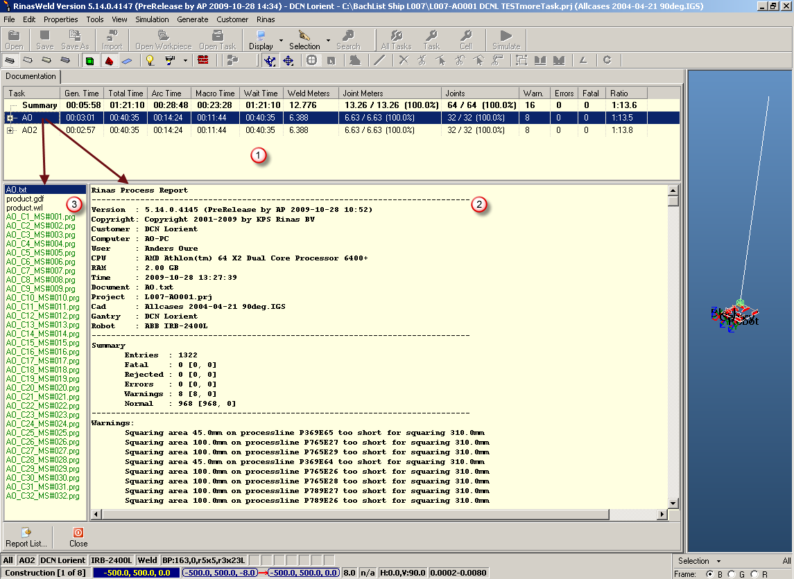

## Task list statistics including Summary

Task list statistics including Summary

Generation statistics, showing used computer time, weld meters, joint meters etc.
see detailed below.

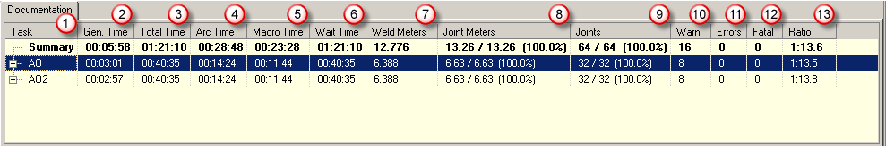

Task Name
Name of generated task.

Generation time used by computer (Job Time)
Time, which the offline computer used during generation.

Total combined execution time for all robots
Approximated, offline calculated, Workshop execution time.
Summary of Arc time, Macro time, Wait time, Sense time and Air movement time.

Time used during welding
The time the welding arc will be on during production.

Time used by macros
Time used by Robot macros, like ‘Tool clean’, ‘Wire Cut’ or ‘Service Tool’.
(based on user setting)

Total waiting time for all robots
Time a robot is waiting for another robot to finish its work or move in place.

Actual weld meters process (scripts included)
Total amount of meters to be welded, Multiple layer weld, intermittent information is taken into account.

Total number of theoretical joints (Archived joints/Total joints available)
Theoretical joint length independent of Multilayer, intermittent weld and scripts.

Number of reported warnings
A warning occurs typically ‘Squaring’ length can be obtained.

Number of reported errors
Number of errors occurred during generation, when a given robot is unable to weld a weld.

Number of reported fatal errors
Fatal errors occurs when the RinasWeld software is encountering a major error. This error can be provoked by a computer malfunction, memory errors etc.

Ratio between “Time used for one robot” and 
“Generation time used by computer”
This value can be used as an indicator of how difficult it was for RinasWeld to find robot positions etc. This value depends on the product complexity as well as the computer performance.

## Task list statistics including Summary Copy

Task list statistics including Summary Copy

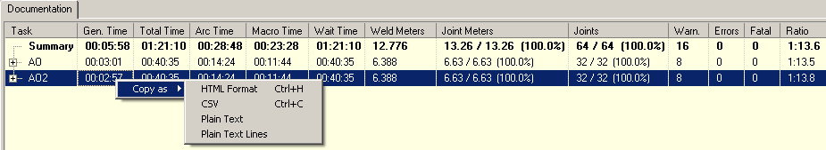

Task list statistics can be exported to a number of different format.

Such as:

HTML Format
Suitable for E-mail and Excel

CSV
Clean comma-separated values

Plain Text
Plain Text, Space formatted text

Plain Text Lines
Plain text, Carriage return separated

All or single lines can be exported.

## Rinas Process Report

Rinas Process Report

The ‘Rinas Process Report’ is made during the generation. The report contains the following log information.

Warnings

Errors

Sequence Rules Information

Bunch Type Assignment

PreTool Check Result

Squaring information

Other information.

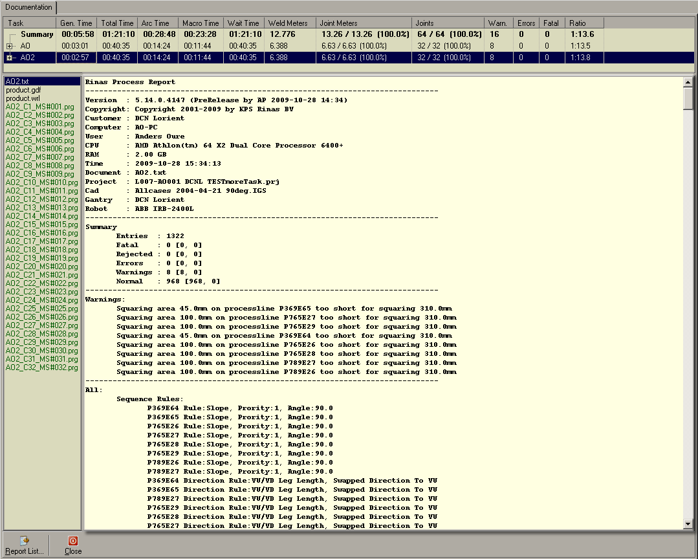

## List of files generated

List of files generated

The window shows a list of the files created during generation; these files are also the files which later will be exported to the online system.

Right mouse click gives a list of options se picture below.

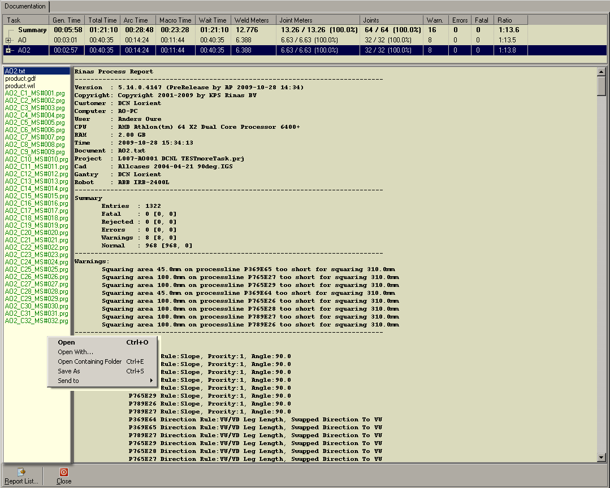

Figure 119 List of generated files

## Print

Print

The report printing allows printing of the current scene and a report print of the segment overview.

Select report and use print or print preview to see the result before sending the document to the printer.

The report can also be saved as a bitmap or copied to the clipboard.

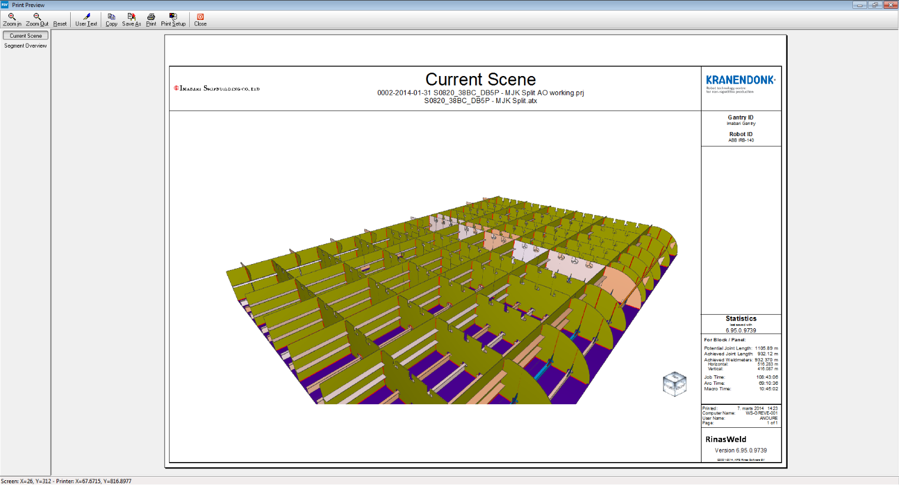

Figure 120 Print Preview dialog

The preview window contains a tool to insert small text segment in the drawing. They are only present as long as the preview is active, and the purpose is only to be able to make a few comments on the drawing.

Figure 121 Example of a hard copy

# Appendix

Appendix

## Abbreviations

Abbreviations

- None at the moment.

## Default configuration

Default configuration

## Keyboard shortcuts

Keyboard shortcuts

A few keyboard shourtcut may be effected by open dialog boxed, due to different edit and memo fields.

## Sense Methods

Sense Methods

The sensing methods are automatically calculated by the system, and can basically be separated into three different forms. These forms are corners, extension and straight types…

### Corners

Corners

Corners are a three or four point sensing, calculated depending on the current situation.

Examples…

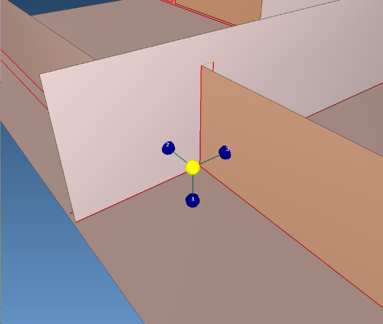

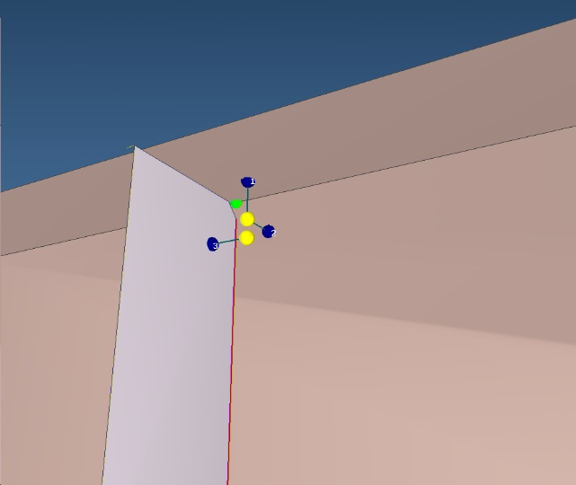

Figure 122                                                                                           Figure 123

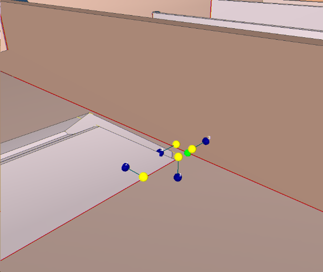

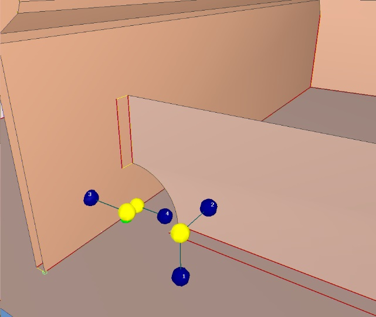

Figure 124                                                                                           Figure 125

Figure 125

### Extensions

Extensions

Extensions are a three point sensing, with a two point sensing calculated depending on the current situation, and the last three points sensing as an end search.

Examples…

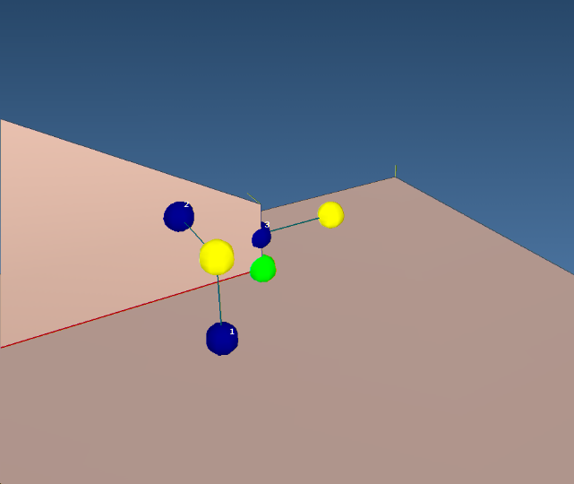

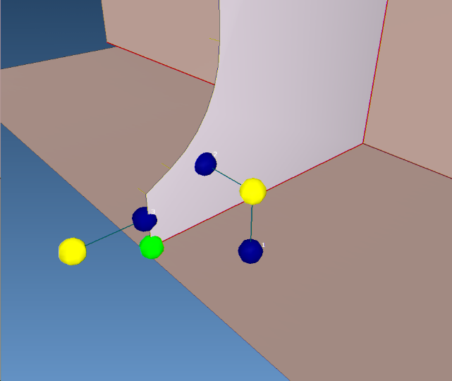

Figure 126                                                                                           Figure 127

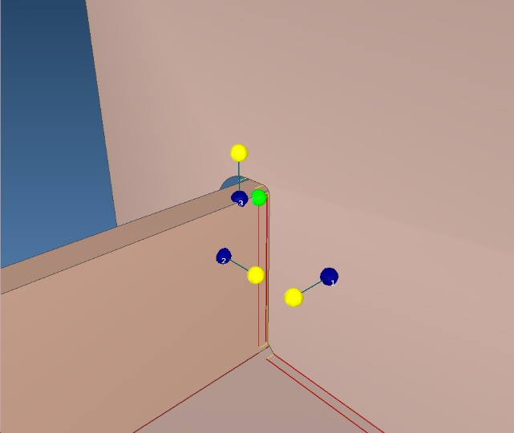

Figure 128

### Straight

Straight

Straight connections are typically created by manually divided process lines, and are a two point sensing.

Examples…

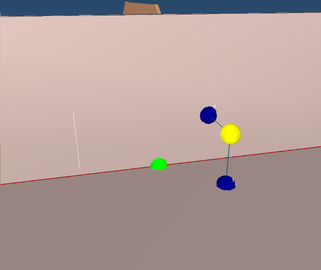

Figure 129

# Table of figures

Table of figures
